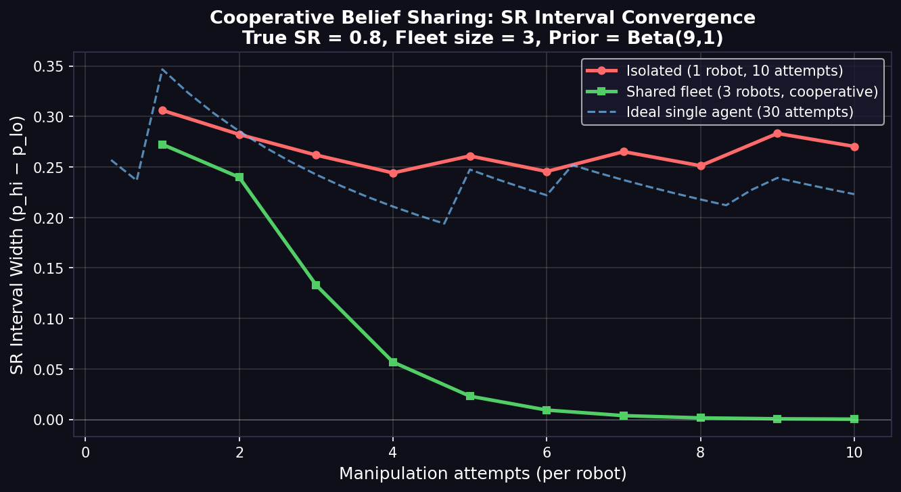

# SR Interval Convergence Experiment

- True SR: 0.8
- Fleet size: 3 robots
- Attempts per robot: 10
- Prior: Beta(9, 1) → mean SR = 0.900

| Attempts/Robot | Isolated Width | Shared Width | Reduction Factor |
|:---:|:---:|:---:|:---:|
|  1 | 0.3061 | 0.2724 | 1.12× |
|  2 | 0.2822 | 0.2398 | 1.18× |
|  3 | 0.2618 | 0.1330 | 1.97× |
|  4 | 0.2441 | 0.0568 | 4.30× |
|  5 | 0.2609 | 0.0230 | 11.34× |
|  6 | 0.2456 | 0.0092 | 26.57× |
|  7 | 0.2652 | 0.0037 | 71.56× |
|  8 | 0.2512 | 0.0015 | 169.10× |
|  9 | 0.2832 | 0.0006 | 475.56× |
| 10 | 0.2703 | 0.0002 | 1132.30× |

**Final isolated width (after 10 attempts): 0.2703**
**Final shared width   (after 10 attempts): 0.0002**
**Convergence speedup: 1132.30×**

